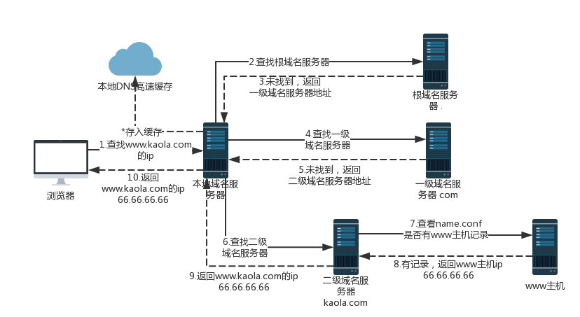
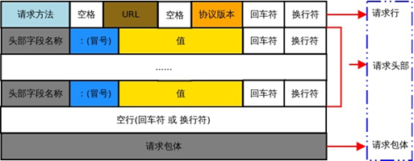
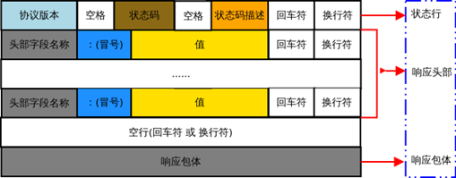

这是一个综合性非常强的问题，可能会在某个点上深挖出非常多的细节，出这个题目的目的就是为了考察你的 web 基础深入到什么程度。学习是一个循序渐进的过程，先明白整体流程再去研究细节，这会对整个知识体系有更深的理解。

总体来说分为以下几个过程：

1. DNS 解析
2. TCP 连接
3. 发送 HTTP 请求
4. 服务端处理请求并返回 HTTP 报文
5. 客户端解析并渲染页面
6. 断开连接

## 1. DNS 解析

在浏览器输入网址后，首先要经过域名解析，因为浏览器并不能直接通过域名找到对应的服务器，而是要通过 IP 地址。互联网上每一台计算机的唯一标识是它的 IP 地址，但是 IP 地址并不方便记忆，用户更喜欢用方便记忆的网址去寻找互联网上的其它计算机，所以互联网设计者需要在用户的方便性与可用性方面做一个权衡，这个权衡就是一个网址到 IP 地址的转换，这个过程就是 DNS 解析。它实际上充当了一个翻译的角色，**实现了网址到 IP 地址的转换**，此时 DNS 服务应运而生。

### DNS 解析过程

DNS 解析是一个递归查询的过程，具体步骤如下图：



上述图片是查找 www.kaola.com 的 IP 地址过程。首先在本地域名服务器中查询 IP 地址，如果没有找到的情况下，本地域名服务器会向根域名服务器发送一个请求，如果根域名服务器也不存在该域名时，本地域名会向 com 顶级域名服务器发送一个请求，依次类推下去。直到最后本地域名服务器得到 google 的 IP 地址并把它缓存到本地，供下次查询使用。

### DNS 优化

1. **DNS 缓存**：浏览器缓存，系统缓存，路由器缓存，IPS 服务器缓存，根域名服务器缓存，顶级域名服务器缓存，主域名服务器缓存。通过缓存直接读取域名相对应的 ip，减去了繁琐的查找 IP 的步骤，大大加快访问速度。
2. **DNS 负载均衡**：使用 CDN 进行负载均衡，利用 DNS 的重定向技术，同步服务器运行情况，然后根据该情况及时适当调整调度策略，从而使得负载均衡能力大大提高。

### DNS 负载均衡

不知道大家有没有思考过一个问题：DNS 返回的 IP 地址是否每次都一样？如果每次都一样是否说明你请求的资源都位于同一台机器上面，那么这台机器需要多高的性能和储存才能满足亿万请求呢？其实真实的互联网世界背后存在成千上百台服务器，大型的网站甚至更多。但是在用户的眼中，它需要的只是处理他的请求，哪台机器处理请求并不重要。DNS 可以返回一个合适的机器的 IP 给用户，例如可以根据每台机器的负载量，该机器离用户地理位置的距离等等，这种过程就是 DNS 负载均衡，又叫做 DNS 重定向。大家耳熟能详的 CDN(Content Delivery Network) 就是利用 DNS 的重定向技术，DNS 服务器会返回一个跟用户最接近的点的 IP 地址给用户，CDN 节点的服务器负责响应用户的请求，提供所需的内容。

## 2. TCP 连接

TCP（Transmission Control Protocol，传输控制协议）是一种面向连接的、可靠的、基于字节流的传输层通信协议。

### 三次握手

1. 客户端发送一个带 `SYN=1,Seq=x` 的数据包到服务端，并进入 `SYN_SEND`状态，等待服务器确认。
2. 服务端发回一个带 `SYN=1,ACK=x+1,Seq=y` 的数据包到客户端，以示传达确认信息，并进入 `SYN_RECV` 状态。
3. 客户端再回传一个带 `ACK=y+1,Seq=z` 的数据包到服务端，包发送完毕后，客户端与服务端都进入 `ESTABLISHED` 状态。完成 TCP 三次握手。

建立 TCP 连接经历下面的三个阶段：

1. 建立连接。通过三次握手（即总共发送 3 个数据包确认已经建立连接）建立客户端和服务器之间的连接。
2. 进行数据传输。这里有一个重要的数据包校验机制，就是接收方接收到数据包后必须要向发送方确认, 如果发送方没有接到这个确认的消息，就判定为数据包丢失，并重发该数据包。当然，发送的过程中还有一个优化策略，就是把大的数据包拆成多个小包，依次传输到接收方，接收方按照这个小包的顺序把它们组装成完整数据包。
3. 断开连接的阶段。数据传输完成，现在要断开连接了，通过四次挥手来断开连接。

到这里，你应该明白 TCP 连接通过什么手段来保证数据传输的可靠性：一是通过**三次握手**确认连接，二是**数据包校验**保证数据到达接收方，三是通过**四次挥手**断开连接。

当然，如果再深入地问，比如为什么要三次握手，两次不行吗？第三次握手失败了怎么办？为什么要四次挥手等等这一系列的问题，涉及计算机网络的基础知识，比较底层，但是也是非常重要的细节，[参考资料](https://zhuanlan.zhihu.com/p/86426969)。

## 3. 发送 HTTP 请求

实这部分又可以称为前端工程师眼中的 HTTP，它主要发生在客户端。发送 HTTP 请求的过程就是构建 HTTP 请求报文并通过 TCP 协议中发送到服务器指定端口(HTTP 协议 80/8080, HTTPS 协议 443)。

### 请求报文

请求报文是由 4 部分组成：**请求行**、**请求报头**、**空行**、**请求包体**。



### 请求行

请求行由**请求方法、URI 、HTTP 协议版本** 3 个部分组成，它们之间使用空格隔开。

```plain
GET /users HTTP/1.1
```

常见的请求方法有：GET、POST、PUT、PATCH、DELETE、HEAD、OPTIONS 等

### 请求头部

请求头部为请求报文添加了一些附加信息，由 “键/值” 对组成，每行一对，名和值之间使用冒号分隔。请求头部通知服务器有关于客户端请求的信息，典型的请求头属性有：

| 请求头          | 含义                                                          |
| --------------- | ------------------------------------------------------------- |
| Accept          | 客户端可识别的响应内容类型列表                                |
| Accept-Encoding | 客户端可接受的编码压缩格式                                    |
| Accept-Language | 客户端可接受的自然语言                                        |
| Accept-Charset  | 可接受的应答的字符集                                          |
| Cache-Control   | 设置客户端缓存方案                                            |
| Connection      | 连接方式 (close/keep-alive)                                   |
| Cookie          | 存储于客户端扩展字段，向同一域名的服务端发送属于该域的 cookie |
| Host            | 请求的主机名，允许多个域名同处一个 IP 地址，即虚拟主机        |
| User-Agent      | 请求的浏览器类型                                              |

### 请求包体

请求包体不在 GET 方法中使用，而在 POST 方法中使用，该方法适用于表单提交场景。与请求包体相关的最常使用的是包体类型 Content-Type 和包体长度 Content-Length。

## 4.服务端处理请求并返回 HTTP 报文

这部分对应的就是后端工程师眼中的 HTTP。后端从在固定的端口接收到 TCP 报文开始，这部分对应于编程语言中的 Socket。它会对 TCP 连接进行处理，对 HTTP 协议进行解析，并按照报文格式进一步封装成 HTTP Request 对象，供上层使用。这部分工作一般是由 Web 服务器去进行。

### 响应报文

HTTP 响应报文也是由三部分组成：**响应行**、**响应报头**和**响应报文**。



### 响应行

状态行由 **HTTP 协议版本**、**状态码**和**状态码描述文本** 3 个部分组成，它们之间使用空格隔开。

状态码由 3 位数字组成，其中第 1 位数字表示响应的类型，常用的状态码有五大类如下所示：

| 状态码 | 含义                                               |
| ------ | -------------------------------------------------- |
| 1xx    | 表示服务器已接收了客户端请求，客户端可继续发送请求 |
| 2xx    | 表示服务器已成功接收到请求并进行处理               |
| 3xx    | 表示服务器要求客户端重定向                         |
| 4xx    | 表示客户端的请求有非法内容                         |
| 5xx    | 表示服务器未能正常处理客户端的请求而出现意外错误   |

常见的状态码有：200, 301, 302, 304, 400, 401, 403, 404, 422, 500, 502, 503 等。

## 5.客户端解析并渲染页面

客户端拿到服务端返回的响应报文，进行数据解析并渲染页面。


浏览器解析渲染页面分为以下几个步骤：

1. 根据 HTML 解析出 DOM 树
2. 根据 CSS 解析生成 CSS 规则树
3. 结合 DOM 树和 CSS 规则树，生成渲染树
4. 根据渲染树计算每一个节点的信息
5. 根据计算好的信息绘制页面

### 根据 HTML 解析生成 DOM 树

- 根据 HTML 的内容，将标签按照结构解析成为 DOM 树，DOM 树解析的过程是一个深度优先遍历。即先构建当前节点的所有子节点，再构建下一个兄弟节点。
- 在读取 HTML 文档，构建 DOM 树的过程中，若遇到 `script` 标签，则 DOM 树的构建会暂停，直至脚本执行完毕。

### 根据 CSS 解析生成 CSS 规则树

- 解析 CSS 规则树时 JavaScript 执行将暂停，直至 CSS 规则树就绪。
- 浏览器在 CSS 规则树生成之前不会进行渲染。

### 生成渲染树

- DOM 树和 CSS 规则树全部准备好了以后，浏览器才会开始构建渲染树。
- 精简 CSS 并可以加快 CSS 规则树的构建，从而加快页面相应速度。

### 根据渲染树计算每一个节点的信息（布局）

- 布局：通过渲染树中渲染对象的信息，计算出每一个渲染对象的位置和尺寸。
- 回流：在布局完成后，发现了某个部分发生了变化影响了布局，那就需要倒回去重新渲染。

### 根据计算好的信息绘制页面

- 绘制阶段，系统会遍历呈现树，并调用呈现器的 paint 方法，将呈现器的内容显示在屏幕上。
- 重绘：某个元素的背景颜色，文字颜色等，不影响元素周围或内部布局的属性，将只会引起浏览器的重绘。
- 回流：某个元素的尺寸发生了变化，则需重新计算渲染树，重新渲染。

## 6. 断开连接

当数据传送完毕，需要断开 tcp 连接，此时发起 tcp 四次挥手。

### 四次挥手

1. 客户端发送一个带 `FIN,ACK,Seq` 的数据包到服务端，表示没有已经没有数据传输了，并进入 `FIN_WAIT_1` 状态。
2. 服务端发回一个带 `ACK, Seq` 的数据包到客户端，表示同意关闭请求，服务端发送数据包后进入 `CLOSE_WAIT` 状态，客户端收到回传的数据包后进入 `FIN_WAIT_2` 状态。
3. 服务端全部数据发送完毕后，发送一个带 `FIN,ACK,Seq` 的数据包到客户端，请求关闭连接，并进入 `LAST_ACK` 状态。
4. 客户端发回一个带 `ACK,Seq` 的数据包到服务端，并进入 `TIME_WAIT` 状态。服务端收到数据包后关闭连接，客户端经过 2MSL 后未收到服务端再次发来的数据包则关闭连接。

---

参考资料：

- [(1.6w 字)浏览器灵魂之问，请问你能接得住几个？](https://juejin.im/post/6844904021308735502)
- [前端经典面试题: 从输入 URL 到页面加载发生了什么？](https://segmentfault.com/a/1190000006879700)
- [经典面试题：从 URL 输入到页面展现到底发生什么？](https://zhuanlan.zhihu.com/p/57895541)
- [从输入页面地址到展示页面信息都发生了些什么？](https://github.com/kaola-fed/blog/issues/271)
- [面试官，不要再问我三次握手和四次挥手](https://zhuanlan.zhihu.com/p/86426969)
