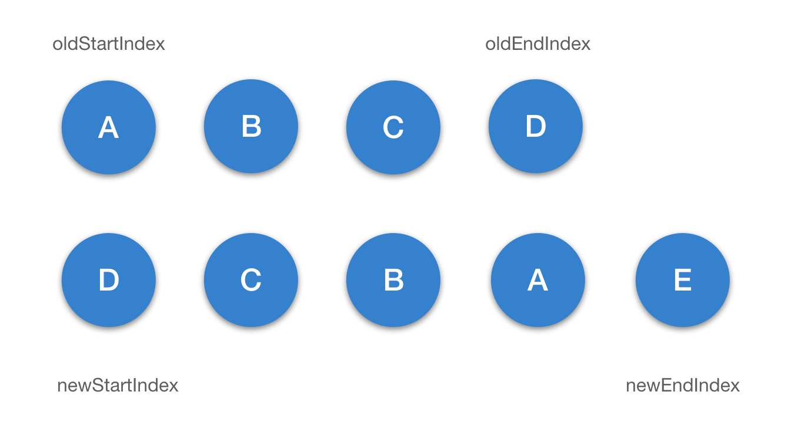
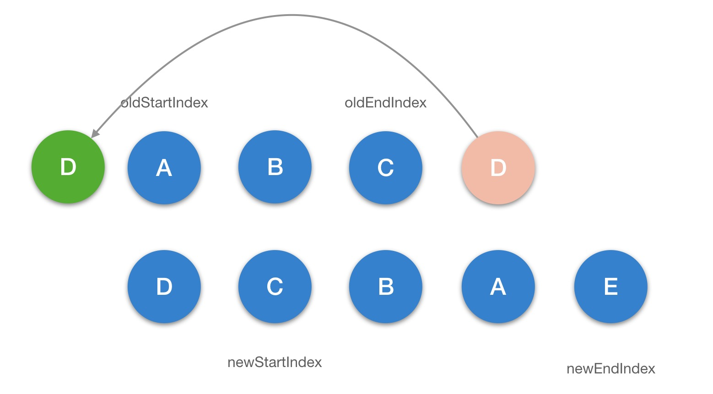

组件的更新仍然会执行 `patch` 方法，不同的是更新时 `oldVnode` 不为空，并且它和 `vnode` 都是 VNode 类型，接下来会通过 `sameVNode(oldVnode, vnode)` 判断它们是否是相同的 VNode 来决定走不同的更新逻辑。

```js title="src/core/vdom/patch.js"
export function createPatchFunction(backend) {
  // ...

  return function patch(oldVnode, vnode, hydrating, removeOnly) {
    if (isUndef(vnode)) {
      if (isDef(oldVnode)) invokeDestroyHook(oldVnode);
      return;
    }

    let isInitialPatch = false;
    const insertedVnodeQueue = [];

    if (isUndef(oldVnode)) {
      // empty mount (likely as component), create new root element
      isInitialPatch = true;
      createElm(vnode, insertedVnodeQueue);
    } else {
      const isRealElement = isDef(oldVnode.nodeType);
      if (!isRealElement && sameVnode(oldVnode, vnode)) {
        // patch existing root node
        // highlight-next-line
        patchVnode(oldVnode, vnode, insertedVnodeQueue, removeOnly);
      } else {
        if (isRealElement) {
          // ...
        }

        // replacing existing element
        const oldElm = oldVnode.elm;
        const parentElm = nodeOps.parentNode(oldElm);

        // create new node
        createElm(
          vnode,
          insertedVnodeQueue,
          // extremely rare edge case: do not insert if old element is in a
          // leaving transition. Only happens when combining transition +
          // keep-alive + HOCs. (#4590)
          oldElm._leaveCb ? null : parentElm,
          nodeOps.nextSibling(oldElm)
        );

        // update parent placeholder node element, recursively
        if (isDef(vnode.parent)) {
          let ancestor = vnode.parent;
          const patchable = isPatchable(vnode);
          while (ancestor) {
            for (let i = 0; i < cbs.destroy.length; ++i) {
              cbs.destroy[i](ancestor);
            }
            ancestor.elm = vnode.elm;
            if (patchable) {
              for (let i = 0; i < cbs.create.length; ++i) {
                cbs.create[i](emptyNode, ancestor);
              }
              // #6513
              // invoke insert hooks that may have been merged by create hooks.
              // e.g. for directives that uses the "inserted" hook.
              const insert = ancestor.data.hook.insert;
              if (insert.merged) {
                // start at index 1 to avoid re-invoking component mounted hook
                for (let i = 1; i < insert.fns.length; i++) {
                  insert.fns[i]();
                }
              }
            } else {
              registerRef(ancestor);
            }
            ancestor = ancestor.parent;
          }
        }

        // destroy old node
        if (isDef(parentElm)) {
          removeVnodes(parentElm, [oldVnode], 0, 0);
        } else if (isDef(oldVnode.tag)) {
          invokeDestroyHook(oldVnode);
        }
      }
    }

    invokeInsertHook(vnode, insertedVnodeQueue, isInitialPatch);
    return vnode.elm;
  };
}
```

## 新旧节点不同

如果新旧 vnode 不同，那么更新的逻辑非常简单，它本质上是要替换已存在的节点，大致分为 3 步：

1. 创建新节点
2. 更新父的占位符节点
3. 删除旧节点

## 新旧节点相同

如果新旧 vnode 相同，更新策略就会相对复杂，它会调用 `patchVNode` 方法。

```js title="src/core/vdom/patch.js"
function patchVnode(oldVnode, vnode, insertedVnodeQueue, removeOnly) {
  if (oldVnode === vnode) {
    return;
  }

  const elm = (vnode.elm = oldVnode.elm);

  if (isTrue(oldVnode.isAsyncPlaceholder)) {
    if (isDef(vnode.asyncFactory.resolved)) {
      hydrate(oldVnode.elm, vnode, insertedVnodeQueue);
    } else {
      vnode.isAsyncPlaceholder = true;
    }
    return;
  }

  // reuse element for static trees.
  // note we only do this if the vnode is cloned -
  // if the new node is not cloned it means the render functions have been
  // reset by the hot-reload-api and we need to do a proper re-render.
  if (
    isTrue(vnode.isStatic) &&
    isTrue(oldVnode.isStatic) &&
    vnode.key === oldVnode.key &&
    (isTrue(vnode.isCloned) || isTrue(vnode.isOnce))
  ) {
    vnode.componentInstance = oldVnode.componentInstance;
    return;
  }

  let i;
  const data = vnode.data;
  if (isDef(data) && isDef((i = data.hook)) && isDef((i = i.prepatch))) {
    i(oldVnode, vnode);
  }

  const oldCh = oldVnode.children;
  const ch = vnode.children;
  if (isDef(data) && isPatchable(vnode)) {
    for (i = 0; i < cbs.update.length; ++i) cbs.update[i](oldVnode, vnode);
    if (isDef((i = data.hook)) && isDef((i = i.update))) i(oldVnode, vnode);
  }
  if (isUndef(vnode.text)) {
    if (isDef(oldCh) && isDef(ch)) {
      // highlight-next-line
      if (oldCh !== ch) updateChildren(elm, oldCh, ch, insertedVnodeQueue, removeOnly);
    } else if (isDef(ch)) {
      if (isDef(oldVnode.text)) nodeOps.setTextContent(elm, '');
      addVnodes(elm, null, ch, 0, ch.length - 1, insertedVnodeQueue);
    } else if (isDef(oldCh)) {
      removeVnodes(elm, oldCh, 0, oldCh.length - 1);
    } else if (isDef(oldVnode.text)) {
      nodeOps.setTextContent(elm, '');
    }
  } else if (oldVnode.text !== vnode.text) {
    nodeOps.setTextContent(elm, vnode.text);
  }
  if (isDef(data)) {
    if (isDef((i = data.hook)) && isDef((i = i.postpatch))) i(oldVnode, vnode);
  }
}
```

`patchVnode` 的作用就是把新的 `vnode` patch 到旧的 `vnode` 上，这里我们只关注关键的核心逻辑，我把它拆成四步骤：

1. 执行 `prepatch` 钩子函数，该方法就是拿到新的 `vnode` 的组件配置以及组件实例，更新实例 `vm` 的一系列属性，包括占位符 `vm.$vnode` 的更新、`slot` 的更新、`listeners` 的更新、`props` 的更新等。
2. 执行 `update` 钩子函数
3. 完成 `patch` 过程，非文本节点 `oldCh` 和 `ch` 都存在且不相同时，执行 `updateChildren` 函数更新子节点，这里涉及 diff 算法
4. 当只有旧节点是文本节点的时候，则清除其节点文本内容。

### updateChildren

```js title="src/core/vdom/patch.js"
function updateChildren(parentElm, oldCh, newCh, insertedVnodeQueue, removeOnly) {
  let oldStartIdx = 0;
  let newStartIdx = 0;
  let oldEndIdx = oldCh.length - 1;
  let oldStartVnode = oldCh[0];
  let oldEndVnode = oldCh[oldEndIdx];
  let newEndIdx = newCh.length - 1;
  let newStartVnode = newCh[0];
  let newEndVnode = newCh[newEndIdx];
  let oldKeyToIdx, idxInOld, vnodeToMove, refElm;

  // removeOnly is a special flag used only by <transition-group>
  // to ensure removed elements stay in correct relative positions
  // during leaving transitions
  const canMove = !removeOnly;

  while (oldStartIdx <= oldEndIdx && newStartIdx <= newEndIdx) {
    if (isUndef(oldStartVnode)) {
      oldStartVnode = oldCh[++oldStartIdx]; // Vnode has been moved left
    } else if (isUndef(oldEndVnode)) {
      oldEndVnode = oldCh[--oldEndIdx];
      // highlight-next-line
    } else if (sameVnode(oldStartVnode, newStartVnode)) {
      patchVnode(oldStartVnode, newStartVnode, insertedVnodeQueue);
      oldStartVnode = oldCh[++oldStartIdx];
      newStartVnode = newCh[++newStartIdx];
      // highlight-next-line
    } else if (sameVnode(oldEndVnode, newEndVnode)) {
      patchVnode(oldEndVnode, newEndVnode, insertedVnodeQueue);
      oldEndVnode = oldCh[--oldEndIdx];
      newEndVnode = newCh[--newEndIdx];
      // highlight-next-line
    } else if (sameVnode(oldStartVnode, newEndVnode)) {
      // Vnode moved right
      patchVnode(oldStartVnode, newEndVnode, insertedVnodeQueue);
      canMove &&
        nodeOps.insertBefore(parentElm, oldStartVnode.elm, nodeOps.nextSibling(oldEndVnode.elm));
      oldStartVnode = oldCh[++oldStartIdx];
      newEndVnode = newCh[--newEndIdx];
      // highlight-next-line
    } else if (sameVnode(oldEndVnode, newStartVnode)) {
      // Vnode moved left
      patchVnode(oldEndVnode, newStartVnode, insertedVnodeQueue);
      canMove && nodeOps.insertBefore(parentElm, oldEndVnode.elm, oldStartVnode.elm);
      oldEndVnode = oldCh[--oldEndIdx];
      newStartVnode = newCh[++newStartIdx];
    } else {
      if (isUndef(oldKeyToIdx)) oldKeyToIdx = createKeyToOldIdx(oldCh, oldStartIdx, oldEndIdx);
      idxInOld = isDef(newStartVnode.key)
        ? oldKeyToIdx[newStartVnode.key]
        : findIdxInOld(newStartVnode, oldCh, oldStartIdx, oldEndIdx);
      if (isUndef(idxInOld)) {
        // New element
        createElm(
          newStartVnode,
          insertedVnodeQueue,
          parentElm,
          oldStartVnode.elm,
          false,
          newCh,
          newStartIdx
        );
      } else {
        vnodeToMove = oldCh[idxInOld];
        if (sameVnode(vnodeToMove, newStartVnode)) {
          patchVnode(vnodeToMove, newStartVnode, insertedVnodeQueue);
          oldCh[idxInOld] = undefined;
          canMove && nodeOps.insertBefore(parentElm, vnodeToMove.elm, oldStartVnode.elm);
        } else {
          // same key but different element. treat as new element
          createElm(
            newStartVnode,
            insertedVnodeQueue,
            parentElm,
            oldStartVnode.elm,
            false,
            newCh,
            newStartIdx
          );
        }
      }
      newStartVnode = newCh[++newStartIdx];
    }
  }
  if (oldStartIdx > oldEndIdx) {
    refElm = isUndef(newCh[newEndIdx + 1]) ? null : newCh[newEndIdx + 1].elm;
    addVnodes(parentElm, refElm, newCh, newStartIdx, newEndIdx, insertedVnodeQueue);
  } else if (newStartIdx > newEndIdx) {
    removeVnodes(parentElm, oldCh, oldStartIdx, oldEndIdx);
  }
}
```

第一步：



第二步：



第三步：


第四步：


第五步：


第六步：


## 总结

组件更新的过程核心就是新旧 vnode diff，对新旧节点相同以及不同的情况分别做不同的处理。新旧节点不同的更新流程是创建新节点->更新父占位符节点->删除旧节点；而新旧节点相同的更新流程是去获取它们的 children，根据不同情况做不同的更新逻辑。最复杂的情况是新旧节点相同且它们都存在子节点，那么会执行 `updateChildren` 逻辑，这块儿可以借助画图的方式配合理解。
