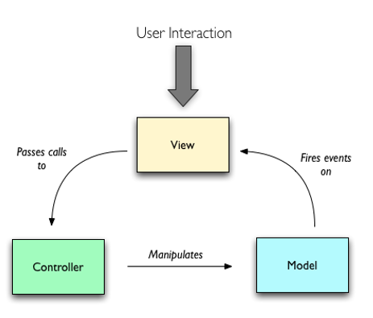
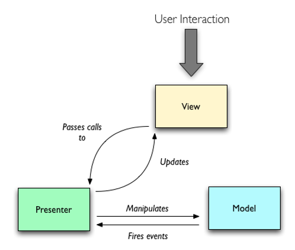
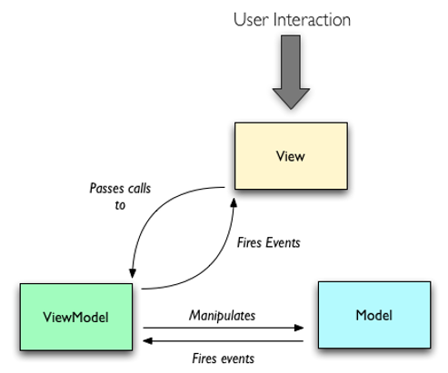

GUI(图形用户界面)的设计结构一搬包括**视图**(View)、**模型**(Model)、**逻辑**(Application Logic, Bussiness Logic, Sync Logic)。在 GUI 中视图和模型是天然可以进行分层的，杂乱无章的部分主要是逻辑，于是出现了 MVC、MVP、MVVM 等设计模式。

## MVC

MVC（Model-View-Controller）把 GUI 分成 View、Model、Controller 三个模块。

- **View**：检测用户的键盘、鼠标等行为，传递调用 Controller 执行应用逻辑。View 更新需要从 Model 重新获取数据。
- **Controller**：处理 View 和 Model 之间协作的应用逻辑或业务逻辑。
- **Model**：Model 变更后，通过观察者模式通知 View 更新视图。

优点：

- 职责分离：模块化程度高、Controller 可替换、可复用性、可扩展性强。
- 多视图更新：使用观察者模式可以做到单 Model 通知多视图实现数据更新。

缺点：

- 依赖强烈：View 强依赖 Model，因此 View 无法组件化设计。

## MVP

MVP（Model-View-Presenter）是 MVC 模式的一种改良，打破了 View 对于 Model 的依赖，其余的依赖关系保持不变。

- **View**：View 不再处理同步逻辑，对 Presenter 提供接口调用。由于不再依赖 Model，可以让 View 从特定的业务场景中抽离，从而做到组件化。
- **Presenter**：与经典 Controller 相比，任务更加繁重，不仅要处理应用业务逻辑，还要处理同步逻辑（高层次复杂的 UI 操作）。
- **Model**：Model 变更后，通过观察者模式通知 Presenter，如果有视图更新，就调用 View 的接口更新视图。

可能产生的优缺点如下：

- View 可组件化设计。
- Presenter 承担太对事务，难以维护。

## MVVM

MVVM（Model-View-ViewModel）模式是在 MVP 模式的基础上进行了改良，将 Presenter 改良成 ViewModel（抽象视图）。

- **ViewModel**：与 Presenter 相比，内部集成了 Binder(Data-binding Engine，数据绑定引擎)，实现 View 和 Model 的双向绑定，一方发生变化另一方可自动更新。
- **View**：可组件化，例如目前各种流行的 UI 组件框架，View 的变化会通过 Binder 自动更新相应的 Model。
- **Model**：Model 的变化会被 Binder 监听（观察者模式），一旦监听到变化，Binder 就会自动实现视图的更新。

优点：

- ViewModel 内置的 Binder 提供了双向绑定机制，解决了 MVP 大量的手动同步的问题。
- 简化了测试流程，只需保证 Model 正确即可。

缺点：

- 对于简单的应用会造成额外的性能消耗。
- 对于复杂的应用，视图状态较多，视图状态的维护成本增加，ViewModel 构建和维护成本高。
