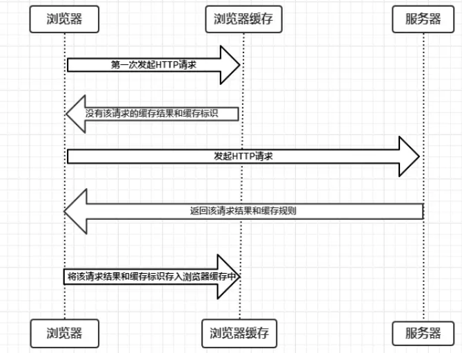
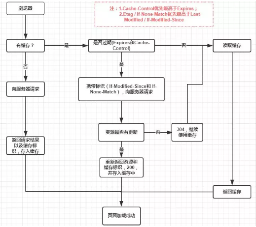

缓存可以说是性能优化中简单高效的一种优化方式了。一个优秀的缓存策略可以缩短网页请求资源的距离，减少延迟，并且由于缓存文件可以重复利用，还可以减少带宽，降低网络负荷。

为什么要使用浏览器缓存？对于一个数据请求来说，可以分为发起网络请求、后端处理、浏览器响应三个步骤。浏览器缓存可以帮助我们在第一和第三步骤中优化性能。比如说直接使用缓存而不发起请求，或者发起了请求但后端存储的数据和前端一致，那么就没有必要再将数据回传回来，这样就减少了响应数据。

## 缓存位置

从缓存位置上来说分为四种：`Service Worker`、`Memory Cache`、`Disk Cache`、`Push Cache`，并且各自有优先级，当依次查找缓存且都没有命中的时候，才会去请求网络。

### Service Worker

Service Worker 是运行在浏览器背后的独立线程，一般可以用来实现缓存功能。

特点：

- 传输协议必须为 HTTPS，因为 Service Worker 中涉及到请求拦截，所以必须使用 HTTPS 协议来保障安全。
- Service Worker 的缓存与浏览器其他内建的缓存机制不同，它可以让我们自由控制缓存哪些文件、如何匹配缓存、如何读取缓存，并且缓存是持续性的。
- 当 Service Worker 没有命中缓存的时候，会根据缓存查找优先级去查找数据。但是不管我们是从内存中还是从网络请求中获取的数据，浏览器都会显示我们是从 Service Worker 中获取的内容。

### Memory Cache

Memory Cache 也就是内存中的缓存，主要包含的是当前中页面中已经抓取到的资源,例如页面上已经下载的样式、脚本、图片等。

特点：

- 读取内存中的数据比读取磁盘中的数据要快得多，读取高效。
- 缓存持续性很短，会随着进程的释放而释放。
- 内存缓存在缓存资源时并不关心返回资源的 HTTP 缓存头 Cache-Control 是什么值，同时资源的匹配也并非仅仅是对 URL 做匹配，还可能会对 Content-Type，CORS 等其他特征做校验。

### Disk Cache

Disk Cache 也就是存储在硬盘中的缓存，读取速度慢点。

特点：

- 读取速度相较 Memory Cache 慢点。
- 缓存的时效性和容量占优。
- 它会根据 HTTP 响应头中的字段判断哪些资源需要缓存，哪些资源可以不请求直接使用，哪些资源已经过期需要重新请求。
- 即使在跨站点的情况下，相同地址的资源一旦被硬盘缓存下来，就不会再次去请求数据。

### Push Cache

Push Cache（推送缓存）是 HTTP/2 中的内容，当以上三种缓存都没有命中时，它才会被使用。

特点：

- 只在会话（Session）中存在，一旦会话结束就被释放，并且缓存时间也很短暂。
- 并非严格执行 HTTP 头中的缓存指令。

## 缓存过程

浏览器与服务器通信的方式为应答模式，即：浏览器发起 HTTP 请求 – 服务器响应该请求。浏览器第一次向服务器发起该请求后拿到请求结果后，将请求结果和缓存标识存入浏览器缓存，浏览器对于缓存的处理是根据第一次请求资源时返回的响应头来确定。

由上图我们可以确定两点：

1. 浏览器每次发起请求，都会先在浏览器缓存中查找该请求的结果以及缓存标识。
2. 浏览器每次拿到返回的请求结果，都会将该结果和缓存标识存入浏览器缓存中。

以上两点结论就是浏览器缓存机制的关键，它确保了每个请求的缓存存入与读取。

## 缓存机制

通常浏览器缓存策略分为两种：**强缓存和协商缓存**，通常缓存策略是通过设置 HTTP 报头来实现。

首先我们来总体感知一下它的匹配流程，如下：

1. 浏览器发送请求前，根据请求头的 `Expires` 和 `Cache-Control` 判断是否命中（包括是否过期）强缓存策略，如果命中，直接从缓存获取资源，并不会发送请求。如果没有命中，则进入下一步。
2. 没有命中强缓存规则，浏览器会发送请求，根据请求头的 `Last-Modified` 和 `Etag` 判断是否命中协商缓存，如果命中，直接从缓存获取资源。如果没有命中，则进入下一步。
3. 如果前两步都没有命中，则直接从服务端获取资源。

### 强缓存

特点：不会向服务器发送请求，直接从缓存中读取资源。

判断依据：根据 `Expires` 或 `Cache-Control` 判断是否超出某个时间或某个时间段，而不关心服务器端文件是否已经更新，这可能会导致加载文件不是服务器端最新的内容。

表示方式：该请求返回 200 状态码，并且 Network Size 显示为 `from memory cache` 或 `from disk cache`。

#### Expires

缓存过期时间，用来指定资源到期的时间，是服务器端的具体的时间点。第一次请求服务器资源时，HTTP 响应头会带有 `Expries` 字段，告诉浏览器一个具体的过期时间，在此时间前浏览器可直接在缓存中读取资源，而无需发送新的请求。该字段和协商缓存的 `Last-Modified` 字段结合使用。

`Expires` 是 HTTP/1.0 产物，受限于本地时间，如果修改了本地时间，可能会造成缓存失效。

#### Cache-Control

由于 `Expires` 存在的缺陷，HTTP/1.1 推出了 `Cache-Control` 规则控制资源缓存。比如： `Cache-Control: max-age=30` 表示该资源请求后的 30s 内再次加载资源，就会命中强缓存。

`Cache-Control` 可以在请求头或者响应头中设置，并且可以组合使用多种指令：

| 指令         | 作用                                                   |
| ------------ | ------------------------------------------------------ |
| public       | 表示响应可以被客户端和代理服务器缓存                   |
| private      | 表示响应只可以被客户端缓存                             |
| max-age=30   | 缓存 30s 后过期，需要重新请求                          |
| s-message=30 | 覆盖 max-age，作用一样，只在代理服务器中生效           |
| no-store     | 不缓存任何响应                                         |
| no-cache     | 资源被缓存，但是立即失效，下次发起请求验证资源是否过期 |
| max-state=30 | 30s 内，即使缓存过期，也使用改缓存                     |
| max-fresh=20 | 希望在 30s 内获取最新的响应                            |

可以将多个指令配合起来一起使用，达到多个目的。比如说我们希望资源能被缓存下来，并且是客户端和代理服务器都能缓存，还能设置缓存失效时间等等。

#### 两者对比

- `Expires` 是 HTTP/1.0 产物，`Cache-Control` 是 HTTP/1.1 产物，两者共存时后者优先级更高。
- 两者都是通过判断资源是否过期来命中强缓存。不同的是 `Expires` 是一个具体的时间点，受限于本地时间；`Cache-Control` 是一个期限，从加载资源后起计算。

### 协商缓存

特点：强制缓存失效，浏览器携带缓存标识向服务器发起请求，由服务器根据缓存标识决定是否使用缓存。

判断依据：根据 `Last-Modified/If-Modified-Since` 或 `Etag/If-None-Match` 判断资源是否修改。

表示方式：如果 `If-Modified-Since` 或 `If-None-Match` 对比后，资源没有变化，返回 304 状态码和空响应体，直接从缓存中读取资源；反之，资源发生变化，返回 200 状态码和新资源文件。

#### Last-Modified/If-Modified-Since

- 浏览器在第一次访问资源时，服务器返回资源的同时，在响应头添加 Last-Modified 字段，值是这个资源在服务器上的最后修改时间。
- 浏览器下次请求资源时，如果检测到有 Last-Modified 字段，就添加 If-Modified-Since 请求头字段，值是缓存的 Last-Modified 字段值。
- 服务器再次收到这个资源的请求，会拿 If-Modified-Since 值与资源的最后修改时间对比，如果没有变化，返回 304 状态码和空响应体，客户端直接读取缓存的资源；如果有变化，返回 200 状态码和新的资源。

缺陷：

- 如果本地打开缓存文件，即使没有对文件进行修改，但还是会造成 Last-Modified 被修改，服务端不能命中缓存导致发送相同的资源。
- 因为 Last-Modified 只能以秒计时，如果在不可感知的时间内修改完成文件，那么服务端会认为资源还是命中了，不会返回正确的资源。
- 各机器读取到的时间不一致，也会出现误差的可能性。
  由于 Last-Modified 存在的缺陷，HTTP/1.1 推出了 Etag/If-None-Match 更好的服务协商缓存。

#### Etag/If-None-Match

- 浏览器在第一次访问资源时，服务器返回资源的同时，在响应头添加 Etag 字段，值是这个资源在服务器上的最后一次修改，通过算法生成的唯一标识，只要资源有变化，Etag 就会重新生成。
- 浏览器下次加载资源时，如果检测到有 Etag 字段，就添加 If-None-Match 请求头字段，值是缓存的 Etag 字段值。
- 服务器再次收到这个资源的请求，会拿 If-None-Match 值与服务器上该资源的 Etag 做对比，如果匹配，返回 304 状态码和空响应体，客户端直接在缓存中读取资源；如果不匹配，返回 200 状态码和新的资源。

#### 两者对比

- Last-Modified/If-Modified-Since 是 HTTP/1.0 产物，Etag/If-None-Match 是 HTTP/1.1 产物，两者共存时后者优先级更高。
- 在精度上 Etag 要优于 Last-Modified，Etag 是通过算法计算出来的一个 Hash 值。
- 在性能上 Etag 要逊于 Last-Modified，毕竟 Last-Modified 只需要记录文件修改的时间。

## 实际场景应用缓存策略

频繁变动的资源：使用 `Cache-Control: no-cache`，设置不使用强缓存，使浏览器每次都请求服务器，然后配合 `ETag` 或者 `Last-Modified` 来验证资源是否有效。这样的做法虽然不能节省请求数量，但是能显著减少响应数据大小。

不常变动的资源：使用 `Cache-Control: max=3153600`，这样浏览器之后请求相同的 URL 会命中强制缓存。如果有更新的话，可以更新资源的名，比如：添加 hash 值、版本号等，达到更改 URL 的目的，从而让客户端请求新资源。

## 缓存影响

- 打开网页：查找 `disk cache` 中是否有匹配。如有则使用；如没有则发送网络请求。
- 普通刷新(F5)：因为 TAB 并没有关闭，因此 `memory cache` 是可用的，会被优先使用（如果匹配的话），其次才是 `disk cache`。
- 强制刷新(Ctrl+F5)：浏览器不使用缓存，因此发送的请求头部均带有 `Cache-Control: no-cache` (为了兼容，还有 `Pragma:no-cache`)，服务器直接返回 200 和最新内容。
